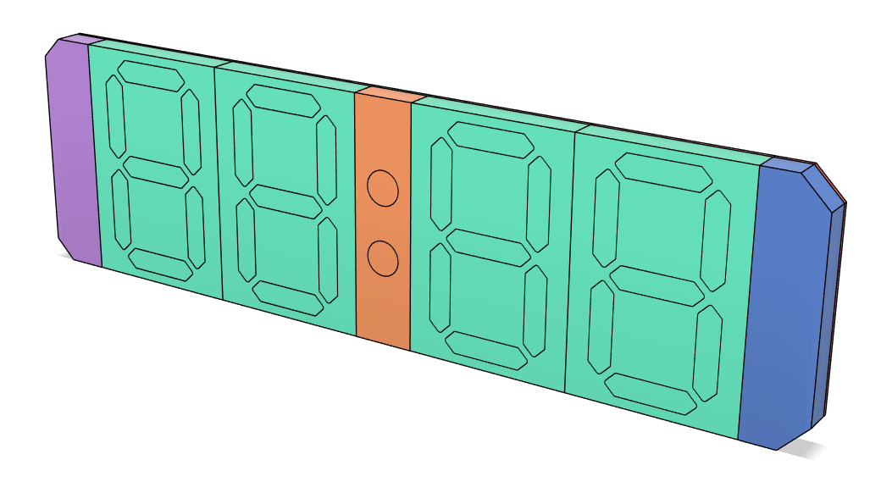
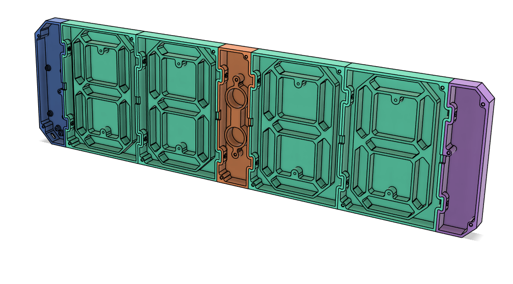
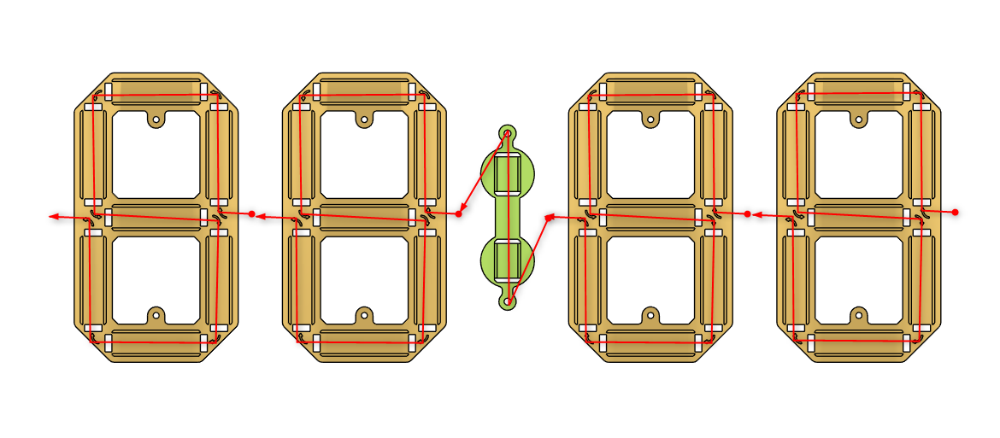
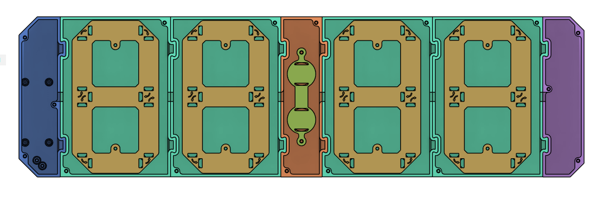
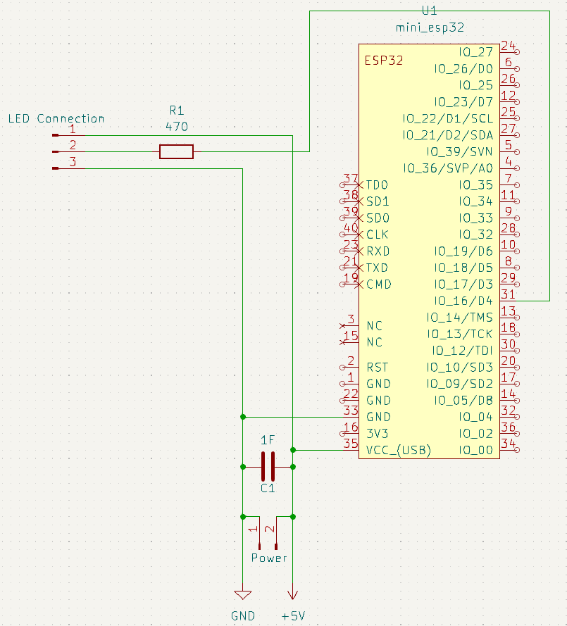
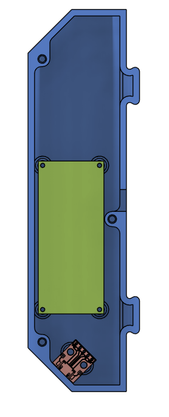

# Assembly Guide
This guide describes how to build the clock

- [Assembly Guide](#assembly-guide)
  - [1. Clock Assembly](#1-clock-assembly)
  - [2. LED strip wiring](#2-led-strip-wiring)
  - [3. Final assembly](#3-final-assembly)
  - [4. Integrate electronics](#4-integrate-electronics)
  - [5. Install Software](#5-install-software)

## 1. Clock assembly
Assemble the start, end, digit and colon segments according to the following picture:

You can optionally secure the segments with the 3x8mm flat head screws and M3 nuts.

## 2. LED strip wiring
Every 7-segment-digit requires three LEDs. Wire the LEDs in the following way. The arrows on the LED holders give additional guidance

## 3. Final Assembly
Mount the LED holders to the digit and colon segments. Note that this is the view from the back:

## 4. Integrate Electronics
Wire the electronics either by ordering the provided PCB or by the following schematics:

Install the PCB and the micro USB board in the start segment and wire the pcb with the leds:

Close the segments with the back covers and secure them with M3x8 countersunk head screws

## 5. Install Software
Connect the ESP32 via USB and go to [Install](https://l0calgost.github.io/ledclock/) to install the software
