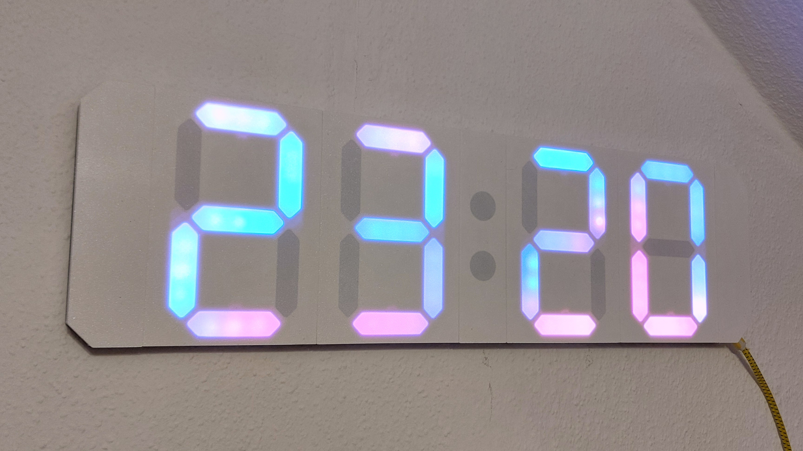
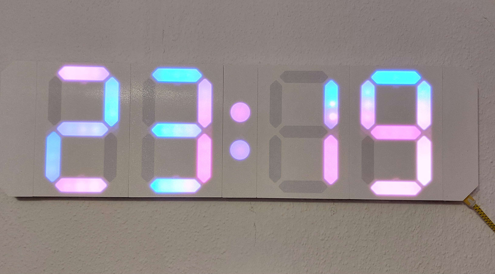

  
  
  
  

# LED Clock

A customizable 7-segment style Wi-Fi connected clock powered by [WLED](https://github.com/Aircoookie/WLED) and the clock adaption from [imeszaros](https://github.com/imeszaros/ledclock). This repository not only hosts the source code of the firmware but also serves as the documentation of this project providing all necessary files and information to replicate it.

## Overview

The clock has three essential parts: a 3D-printed enclosure, the electronics and the firmware.

**The enclosure** was designed in Fusion 360. 3D printing it requires one color, preferably white. The clock consists of several parts, the biggest part is 126x175x20mm.

**The electronics** are fairly simple: the heart of the project is an ESP32 chip which drives 86 pieces of WS2812b individually addressable LED chips. The LEDs form four 7-segment displays (each segment has three LEDs) and a separator consisting of two LEDs. An USB interface circuitry is also included for easy firmware upgrades.

**The firmware** is powered by the awesome project [WLED](https://github.com/Aircoookie/WLED). It is pre-configured with all the correct parameters, hides all irrelevant settings and features but provides additional functionality specific to this project.

Here are two pictures of the completed project:

## Features

- Clock function
    - 12 or 24 hour format
    - automatic time synchronization from the internet
- Timer function
- Stopwatch function
    - Lap time recording
- Control interface available on any device with a browser on the same wireless network
- Android, iPhone, iPad applications (provided by the [WLED](https://github.com/Aircoookie/WLED-App) project)
- Configurable display effects and colors
- Automatic brightness control based on ambient light intensity
- Configurable beeps

See a couple of shots from the ui (click to enlarge):

## How to use

Please check the [user's guide](/ledclock/users-guide.md) to get an overview of the features and settings. You may also check the [WLED knowledgebase](https://kno.wled.ge/) for further information.

## Would you like to make it?

This repository has all information you need to make this project:

- [CAD plans for the enclosure](/ledclock/models/cad/)
- [3MF files to 3D print it](/ledclock/models/3d-print/)
- [Schematic and PCB design](/ledclock/sch-pcb/)
- [Gerber files for PCB production](/ledclock/gerber/)
- [Bill of materials](/ledclock/bill-of-materials.md)
- [Assembly insctructions](/ledclock/assembly-guide.md)

## Do you like it?

Do you need help? Have you built the clock? Feel free to [contact me](https://github.com/l0calgost).

